# pomodoro-svg

A pomodoro timer for your README. One SVG file — no server, no workflow, no JavaScript,
no external requests.

**The timer starts when the image is painted**, so opening the page is what pressing
"start" means. It keeps running while the tab is in the background.

<p align="center">
  <picture>
    <source media="(prefers-color-scheme: dark)" srcset="dist/pomodoro-ring-25-5-dark.svg">
    
  </picture>
  <picture>
    <source media="(prefers-color-scheme: dark)" srcset="dist/pomodoro-odometer-25-5-dark.svg">
    
  </picture>
  <picture>
    <source media="(prefers-color-scheme: dark)" srcset="dist/pomodoro-matrix-25-5-dark.svg">
    
  </picture>
</p>

## Use it

Paste this into your README, replacing `ring` with whichever design you want:

```html
<picture>
  <source media="(prefers-color-scheme: dark)"
          srcset="https://raw.githubusercontent.com/HibikiHata/pomodoro-svg/v1/dist/pomodoro-ring-25-5-dark.svg">
  
</picture>
```

`v1` follows the latest v1.x release, so bug fixes reach you but a redesign does not.
Pin `v1.0.0` instead if you want the bytes frozen, or use `main` to track every commit.

Wrap it in a link to the same URL and clicking it opens the timer on its own, from zero:

```html
<a href="https://raw.githubusercontent.com/HibikiHata/pomodoro-svg/v1/dist/pomodoro-ring-25-5-light.svg">
  
</a>
```

## Designs

| | Design | |
|---|---|---|
|  | **`ring`** | The ring drains; the phase and its length sit inside |
|  | **`odometer`** | The same ring with the countdown in it |
|  | **`minimal`** | The same dial in one ink. Reads the phase from the word, not a colour |
|  | **`digital`** | A card with a depleting bar |
|  | **`matrix`** | The countdown over falling digits |

Each comes in light and dark. The dots below the timer fill in as you finish each set.

## File names

```
dist/pomodoro-<design>-<work>-<rest>-<light|dark>.svg
```

Five designs (`ring`, `odometer`, `minimal`, `digital`, `matrix`) times four schedules
(`15-5`, `25-5`, `50-10`, `90-20`) times light and dark. **Those forty files are all
that exist** — a name outside that set is a 404.

Why those four schedules, and not one: [docs/behaviour.md](docs/behaviour.md).

## Anything else

Every other combination is one command away. Nothing to install — rendering uses only
the Python standard library.

```
git clone https://github.com/HibikiHata/pomodoro-svg && cd pomodoro-svg
PYTHONPATH=src python3 -m pomodoro --design odometer --work 45 --rest 15 --out .
```

| Option | Default | |
|---|---|---|
| `--work` | `25` | minutes, 1–99 |
| `--rest` | `5` | minutes, 1–99 |
| `--sets` | `4` | 0–12. `0` removes the dots and the long break |
| `--long-rest` | `15` | minutes, must be at least `--rest` |
| `--repeat` | `loop` | or `once`, which ends on `00:00` and `DONE` |
| `--design` | `ring` | see above |
| `--palette` | `default` | or `mono`, `terminal` |
| `--out` | `build` | output directory |

Durations are whole minutes. That constraint is what lets the seconds be one loop
independent of the phase, which is most of why these files are small.

## Good to know

**Reloading restarts it**, and a browser can reload a background tab on its own —
Chrome's Memory Saver discards unused tabs and reloads them when you return, which shows
`25:00` again. There is no way to detect that from inside an SVG.

**There is no pause.** The trade is explained in
[docs/behaviour.md](docs/behaviour.md#there-is-no-pause).

**Motion stops** for viewers whose system asks for reduced motion, leaving a readable
still.

## Licence

Code: MIT. The embedded font subset is Noto Sans JP under the SIL Open Font License 1.1
— the full text is in [`licenses/OFL.txt`](licenses/OFL.txt), and every generated SVG
carries the notice in a comment, because each file is itself a copy of the font.

`src/pomodoro/_reference/` holds the hand-written SVG this grew out of, for reference.
